## 基于Java+ssm汽车租赁管理系统601

## 一、系统介绍

##### 汽车租赁系统总共分为两个大的模块，分别是系统模块和业务模块。其中系统模块和业务模块底下又有其子模块。

#### 一、业务模块

##### 1、客户管理

###### 客户列表

###### 客户分页和模糊查询

###### 客户添加、修改、删除

###### 导出客户数据

##### 2、车辆管理

###### 车辆列表

###### 车辆车辆分页和模糊查询

###### 车辆添加、修改、删除

##### 3、业务管理

###### 汽车出租

1、根据客户身份证查询所有未出租的车辆信息  
2、进行出租

###### 出租单管理

1、多条件的模糊查询和分页  
2、出租单的修改、删除、导出

###### 汽车入库

###### 检查单管理

1、多条件模糊查询和分页  
2、检查单修改  
3、导出检查单

##### 4、统计分析

###### 客户男女比例图

###### 月出租量统计

###### 销售员业绩统计

###### 出租车辆类型统计

#### 二、系统模块

##### 1、用户登陆

###### 校验用户名和密码

###### 登陆成功将登陆信息写入登陆日志

###### 未登录进行拦截

##### 2、菜单管理

###### 全查询菜单和根据左边的树查询不同菜单

###### 菜单的添加、修改、删除

##### 3、角色管理

###### 全查询角色和模糊查询

###### 角色的添加、修改、删除

##### 4、用户管理

###### 全查询用户和模糊查询

###### 用户的添加、修改、删除以及重置密码

##### 5、数据源的监控(druid monitor)

## 二、所用技术

#### 后台技术选型

* Spring
* SpringMVC
* Mybatis

#### 前端技术选型

* LayUI、dtree、echarts

## 三、环境介绍

基础环境 :IDEA/eclipse, JDK 1.8, Mysql5.7,tomcat8,Maven3.6

所有项目以及源代码本人均调试运行无问题 可支持远程调试运行

## 四、页面截图

登陆页面

主页
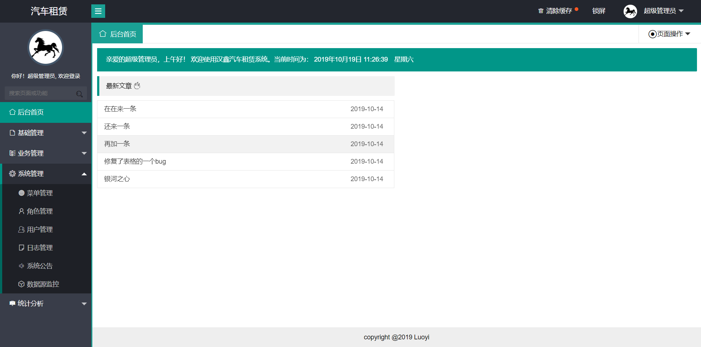
菜单管理
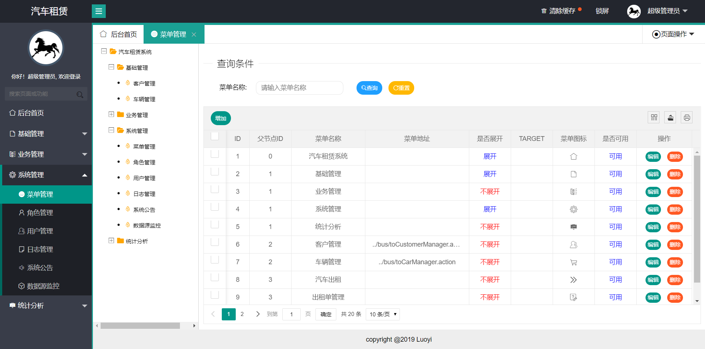
角色管理
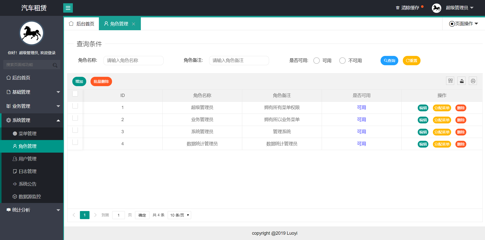
用户管理
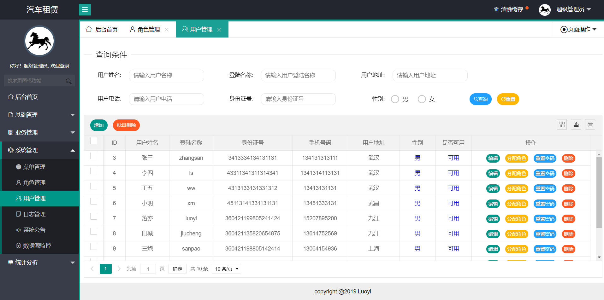
日志管理
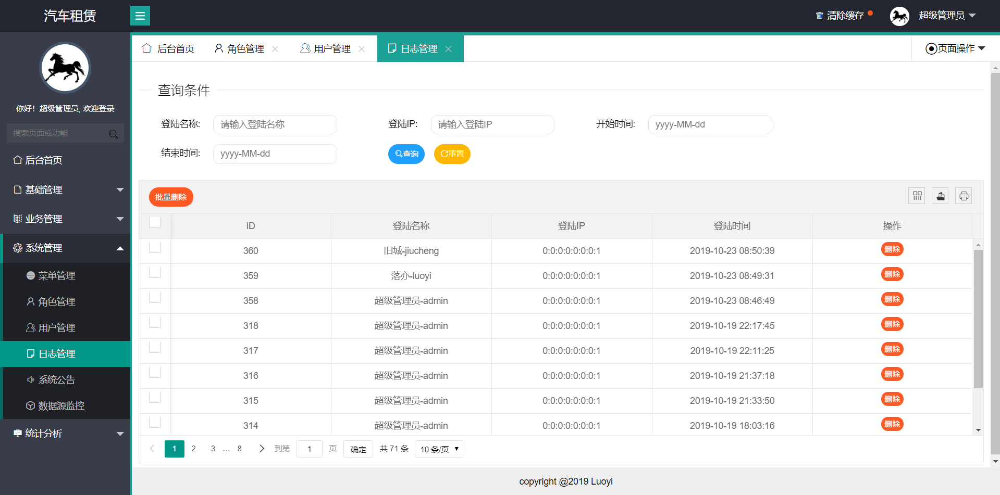
系统公告
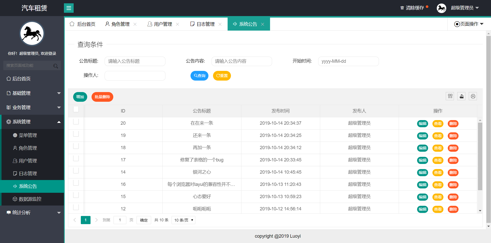
数据源监控
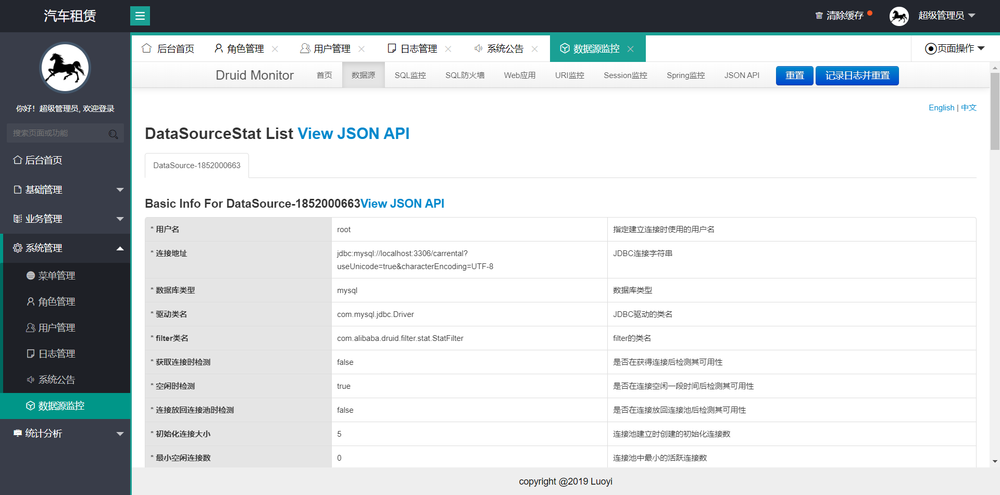
客户管理
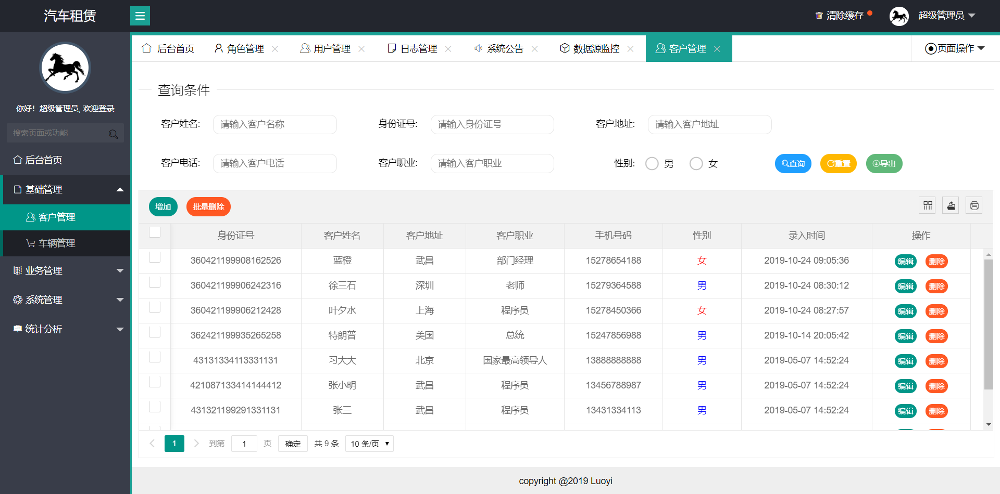
车辆管理
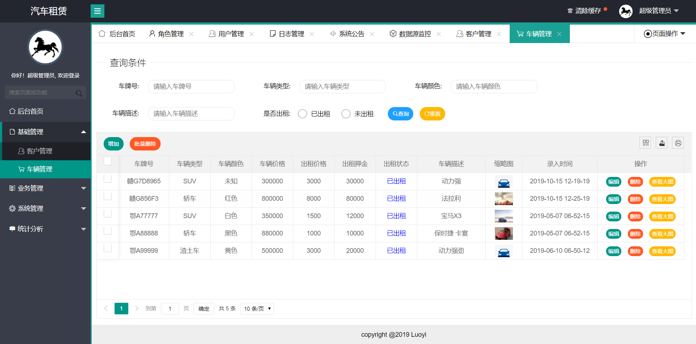
汽车出租
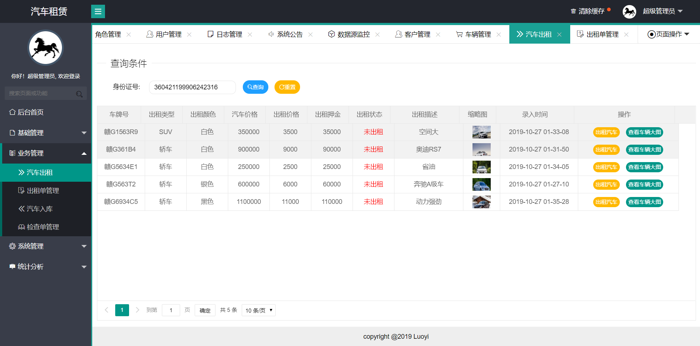
出租单管理
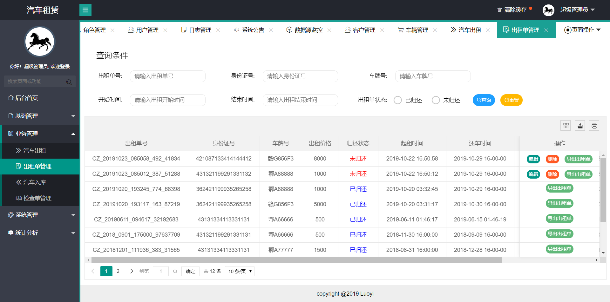
汽车入库
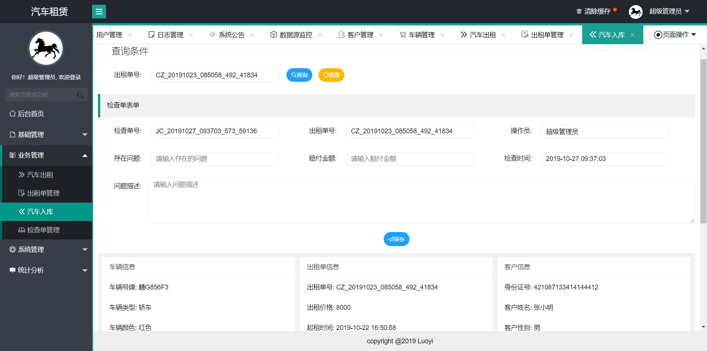
检查单管理
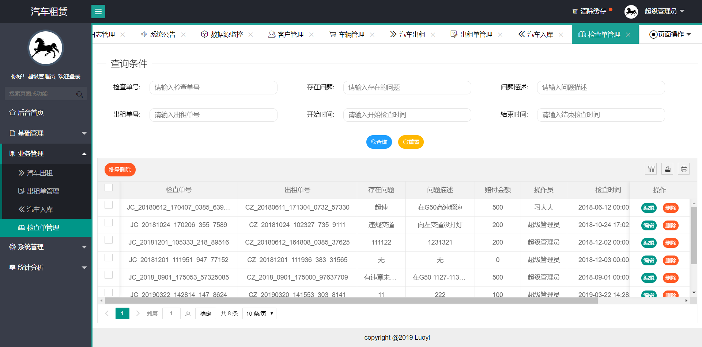
客户地区统计
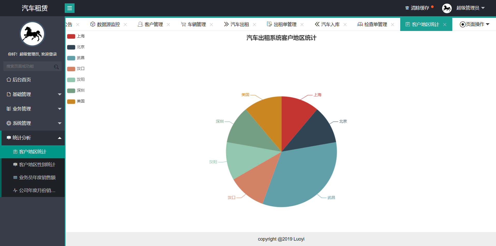
客户地区性别统计
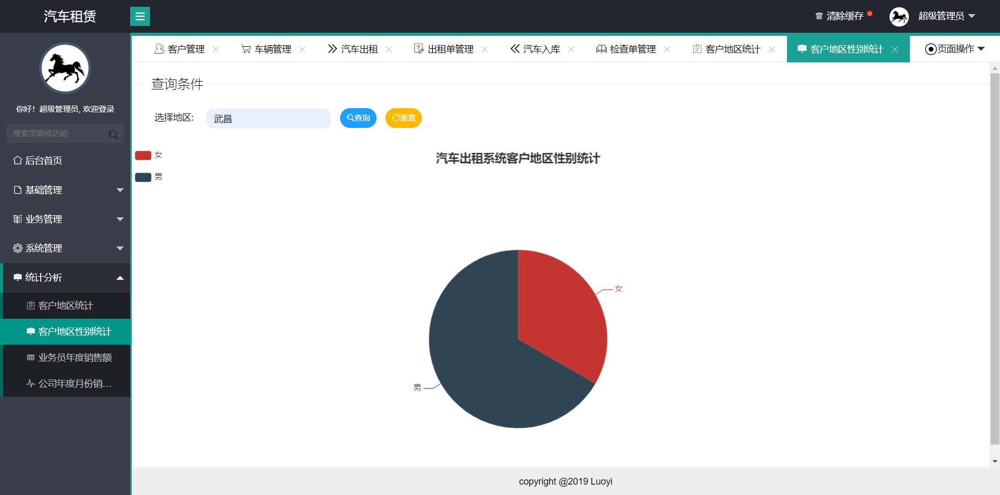
业务员年度销售额统计
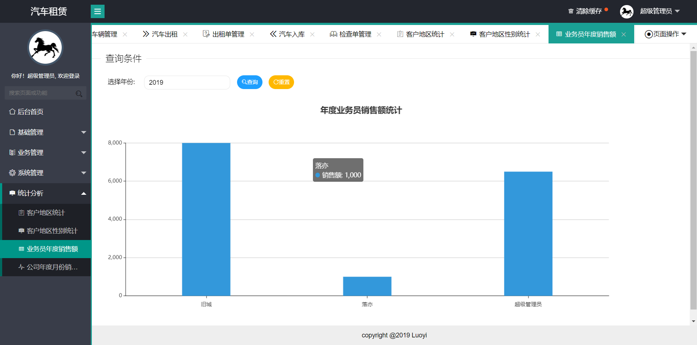
公司年度月份销售额统计
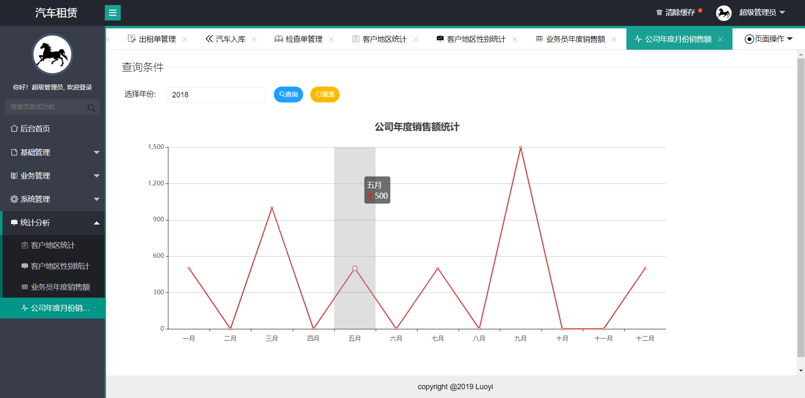

## 五、浏览地址

http://localhost:8989/carRental/

普通用户名：zhangsan    密码：123456

管理员用户名：admin    密码：123456

## 六、安装教程

1. 使用Navicat或者其它工具、在mysql中创建对应名称的数据库、并导入项目的sql文件；
2. 使用IDEA/Eclipse导入项目，若为maven项目请选择maven，导入成功后请执行maven clean;maven install命令
3. 修改src\main\resources里面的db.properties 里面的数据库配置
4. 将项目加入到tomcat容器里面，启动项目 
